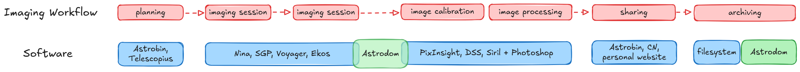
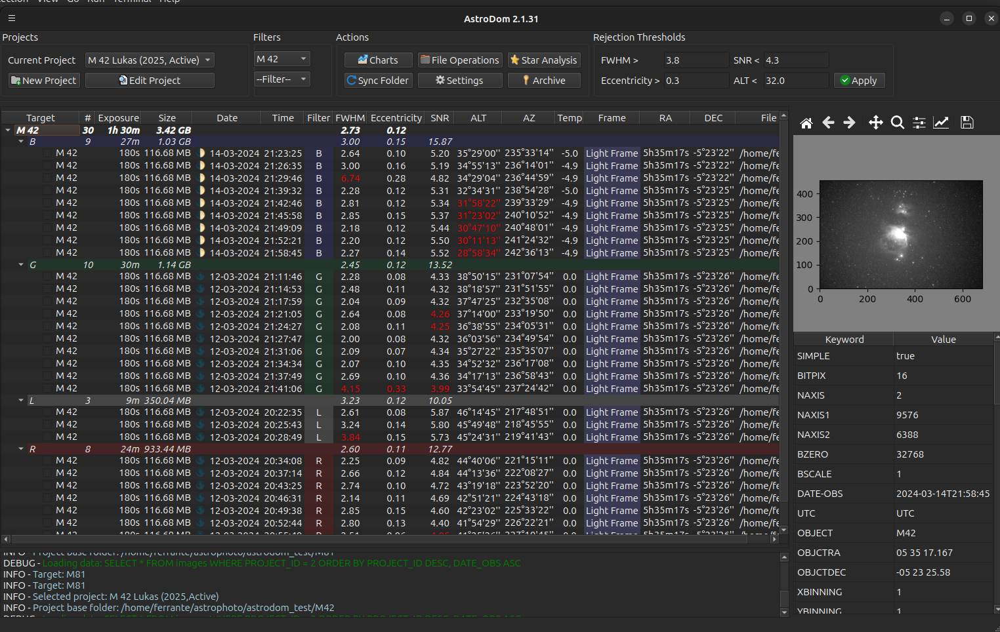

# Astrodom

AstroDom is a culling tool for deep sky imaging sessions and an archive for cataloging images.  
In a standard imaging workflow, Astrodom helps finding the best frames for image processing and stores the information about a target that can be retrieved at any time.

## Features

- Scan folders for FITS file and import in an intenal searchable database
- Calculate important features like FWHM, Eccentricity and SNR fitting the stars with gaussian functions
- Reject images that are below a threshold
- Image data are stored in a database. When original files are deleted or zipped, the user can always retrieve information from the database

## Installation

## Requirements
AstroDom is developed using Python's QT bindings (PyQT) and thus can be installed on Linux, Windows and MacOS platforms.
AstroDom is all about presenting data, so a high definition display (1920x1080 or higher) is recommended. 

## Prerequisites: Python and Venv
AstroDom runs in a python virtual environment (venv). 

Installation of Python and venv is not the main purpose of this document; you can search for many resource that have step by step instruction for your platform.
On a terminal window check  which Python and Virtualenv are installed.

    python --version
    virtualenv --version
  
AstroDom requires **Python version 3.12**.

## Install and Run AstroDom
To install AstroDom, create a directory on your system where you will store AstroDom's file. 
Any name is ok, but '**astrodom**' is recommended.

### Script based installation
Download the install and run scripts to  'astrodom' folder:

https://github.com/fenriques/AstroDom/tree/master/astrodom/rsc/scripts/

Launch the .sh (Linux) or .bat (Win) install script from a terminal window. 

Then to run AstroDom, execute the run script. 
Do not move the run script outside of the 'astrodom' directory; rather  create a desktop icon to launch this script.

### Manual installation
As an alternative to script installation, you can follow these steps:
Install on Linux:

	cd astrodom
    python3 -m venv venv
    source ./venv/bin/activate
    pip3 install astrodom --upgrade --no-cache-dir
  
Install on Windows:

     cd astrodom
     venv\Scripts\activate
     python -m pip install astrodom --upgrade --no-cache-dir
  
  Run on Linux:

    cd astrodom
    source ./venv/bin/activate
    cd ./venv/lib/python3.12/site-packages
    python -m astrodom

  Run on Windows:

    cd astrodom
    venv\Scripts\activate 
    cd venv\Lib\site-packages
    python -m astrodom

### Installation Notes:
On Linux remember to make script executables: chmod +x *.sh
On Linux depending on the python version you could need to update commands both in the manual and script installation. For example ' cd ./venv/lib/python3.7/site-packages' instead of ' cd ./venv/lib/python3.6/site-packages'.
On Windows you could need to change DPI settings if the character are too small.

### Manual installation to avoid version conflicts:
Try these steps if you get errors due to your python version conflicting with libraries version. Tested with python v 3.12

	Check that python and venv and pip are installed
	Open a terminal and create a directory named Astrodom, then cd to it
	Download from the Astrodom project home page on github all the files as .zip, then unzip in the Astrodom directory
	Create a venv: python -m venv venv (you might have to add the python version number e.g. pyrhon3.12 -m venv venv)
	activate the virtual env: venv\Scripts\activate  (win) or  source ./venv/bin/activate (linux)
	Manually install all the packages in requirements.txt, without the version number, e.g. pip install astropy
	Repeat for all other packages
	cd venv\Lib\site-packages
	Run Astrodom: python -m astrodom

Use a terminal window for all commands except for downloading Astrodom sources
## License

This project is licensed under the MIT License. See the [LICENSE](LICENSE) file for details.

## Contact

For any questions or suggestions, please open an issue.

Happy stargazing!