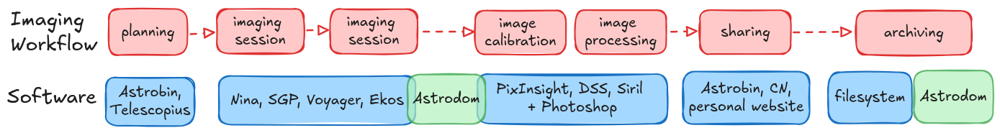

# Astrodom2

AstroDom is a culling tool for deep sky imaging sessions and an archive for cataloging images.  


## Features

- Scan folders for FITS file and import in an intenal searchable database
- Calculate important features like FWHM, Eccentricity and SNR fitting the stars with gaussian functions
- Reject images that are below a threshold
- Image data are stored in a database. When original files are deleted or zipped, the user can always retrieve information from the database


## Installation

## Installation

To install Astrodom from PyPI, use the following command:

```bash
pip install astrodom
```

Make sure you have Python 3.12, venv and pip installed on your system. 


## License

This project is licensed under the MIT License. See the [LICENSE](LICENSE) file for details.

## Contact

For any questions or suggestions, please open an issue.

Happy stargazing!