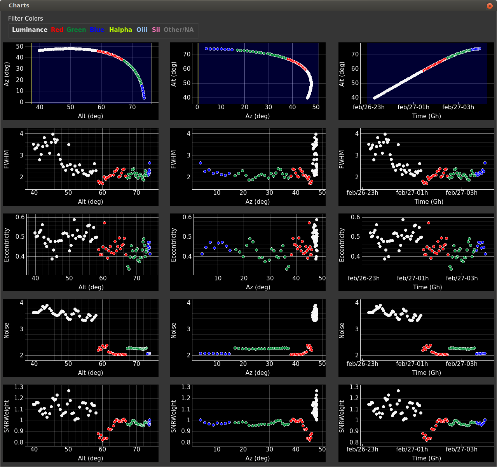

# Charts
This window gives a visual representation of the data selected in the image list; data trends and correlations in your images are easily spotted with this tool.
 
Not all the data in the database are plotted, only the subset that you see in the image list table. In other words, to filter data in charts you have to set data filters in the image list and open click **Charts** again.

 - There are 15 plots: for   **Alt**, **Az** and **Time** AstroDom plots **Alt**, **FWHM**, **Eccentricity**, **Noise** and **SNR**
 - Remember that FWHM, Eccentricity, Noise and SNR are data imported from [PixInsight's SubFrameSelector ](importCsv.md) .
 - Astronomical filters have different colors: see the map at the top of the image.
 - Each plot can be zoomed in/out and panned.
 

