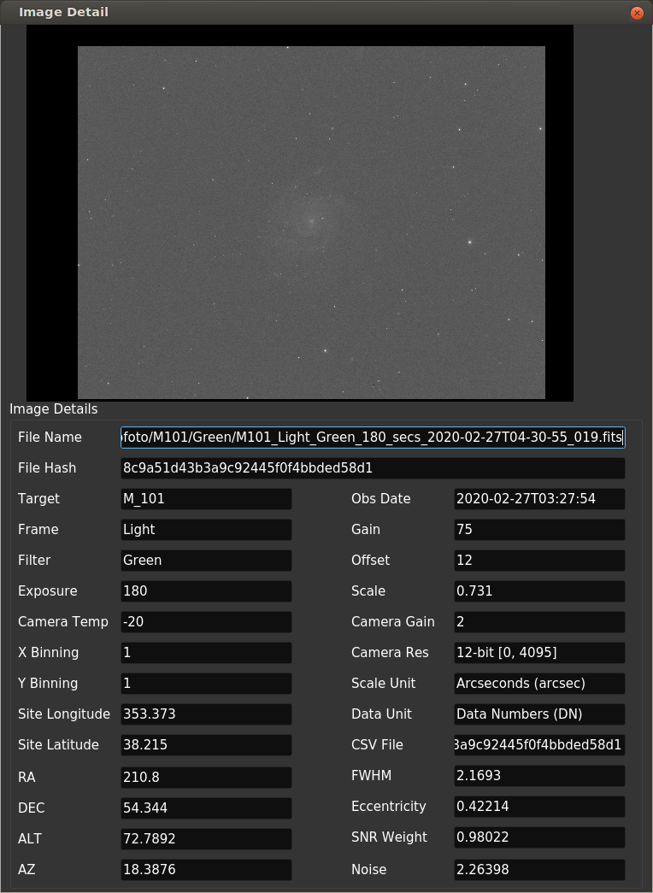

# Image detail
This window is opened when you double-click a row in the image list table.
All the data regarding the selected image are printed including hidden data in the image list table.

A stretched preview of the image is in the upper part (custom stretching,  zooming, WCS coordinates will be added in a next release).
Here you can edit values for each form. Just enter the data in the form and press enter.
 
 

