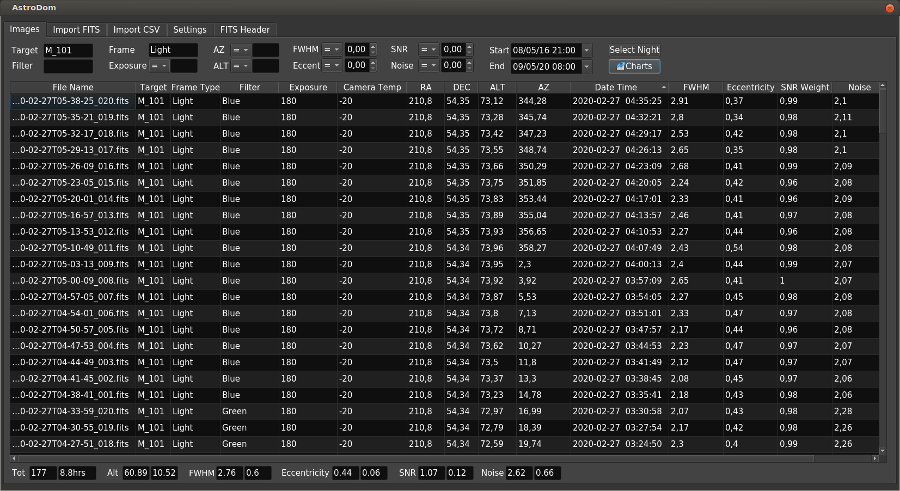

# Image List
Once that you have a database populated with capture's data, AstroDom allows to search through your data, apply filters and sorting, mean and standard deviations in a spreadsheet like interface.

## Filters
 'Filters' could be referred to *data filters* or  to *astronomical filters*. The distinction should be clear from the context but we refer to 
 The upper section features the following data filters:
**Target**: the name of the DSO object; free text, case insensitive search. 
**Frame Type**:  The exact keyword depends on your imaging software, usually it's: Light, Dark or Flat.
**(Astronomical) Filter**: search for one or more filter applied to the image. For OSC it is suggested to set a default 'OSC' or 'Color' value while importing.
**Exposure**: AstroDom doesn't make assumptions on measurement units. It can be seconds or minutes but it is strongly suggested to set exposure in seconds because totals are based on that.
**ALT/AZ**: AstroDom uses decimal representation for coordinates.
**FWHM, Eccentricity, SNR Weight, Noise**: these are all numeric values. FWHM for example is not meant to be in arcsec. Comparison operators can be selected for these filters.
**Start / End**: Date time filter. By default End is current date while Start is a default number of months (selected in [Settings](settings.md)) before End.
**Select Night**: If you select one row in the table, 'Select Night' automatically filters data for that  night only.
**Charts**: Opens the chart window; a chart inherits the data from the filtered table in this window.

In all text fields, the | (pipe) operator is used as OR searches. For example M_101 | M101 would include results containing both M101 and M_101. Warning: Lum | L | Luminance would include all luminance  but also Blue.

Data filters are applied immediately, there's no option to clear all data filters at once.  

## Data table
When started  AstroDom loads all data from the database, the only data filter set is  Start date. 
If loading and filtering slows down to much try to reduce the number of records: filter shorted date interval or create more than one database  (in [Settings](settings.md))

The data table should be easy to navigate: 
- Click on a header to sort data for that column
- Double click on a cell opens [Image Details](imageDetails.md) window
- Drag a column header edge to expand / shrink column
- Toggle column visibility in [Settings](settings.md)
 

## Statistics / Totals
For all data presented in the data table,  the lower bar holds the following information (from left to right):
- Total number of images
- Total integration time (assuming time in secs)
- Mean and Std dev Altitude
- Mean and Std dev FWHM
- Mean and Std dev Eccentricity
- Mean and Std dev SNR
- Mean and Std dev Noise

