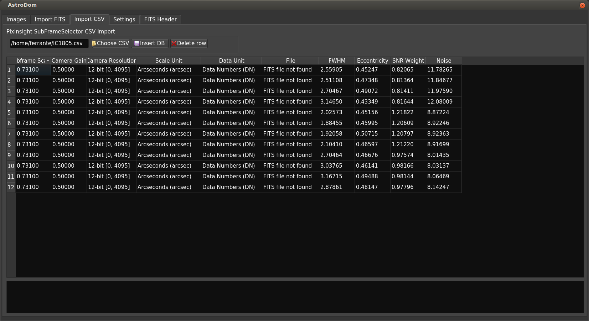

# Import CSV
PixInsight SubFrameSelector process can save information like FWHM, Eccentricity, Noise and SNR to a CSV file.
AstroDom can then merge these data in the image list. 
Important note: you can use this tool only for images that are already save to the database. Refer to : [Import FITS files](importFits.md)

## Operation
in **PixInsight**
Load your FITS file into PixInsight SubFrameSelector process; only not yet processed files should be used because:
- AstroDom cannot read xisf files.
- Processed files differ from the original capture, AstroDom cannot match these two files.

 
 
 Press **Save  CSV** data.

in **AstroDom**
Press **Load CSV** and locate the CSV file on your PC, the data from the file will be loaded to the main table.

AstroDom will match the hash stored in the database of the original FITS file with an hash of the file listed in the CSV file. If these two hashes match, AstroDom is able to update the database. 

Both the table and the log frame at the bottom will show info and error messages that allow to review the import activity.
Press **Update DB** to merge these data into the database.

