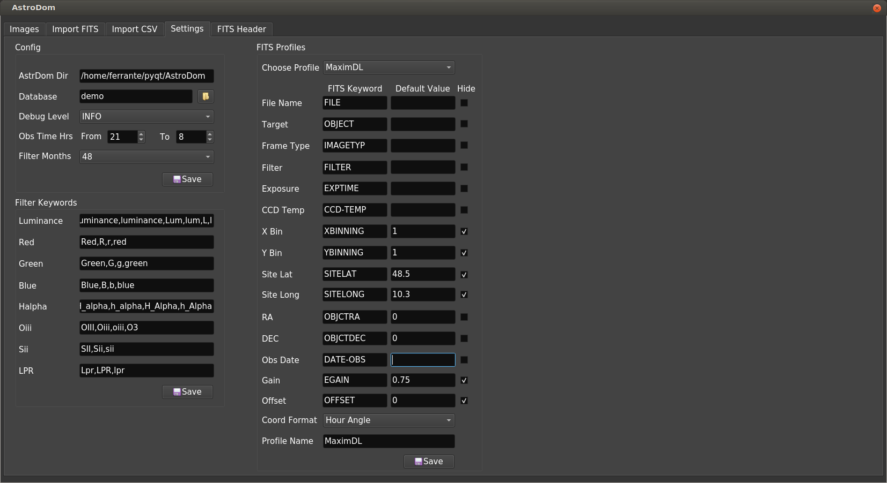

# Settings
Here you can configure AstroDom settings using these three boxes:
- Config 
- Filter Keywords
- FITS Profiles

## Config 

- **Database** is the name of your local AstroDom storage  based on a SQLite rdbms. Db files (with .db extension) are located in /astrodom/config directory.
Entering a text in the form will create a new database; you can have as many databases as this will help organizing your data. AstroDom has been tested with thousands of records. But if you see filters and searches slowing down it could be the case of segregate some data in a new database. 
Existing database can be selected click on the icon on the right of the form.
- **Debug Level**: levels are Debug, Info, Warning, Error, Critical. During normal operation recommended is 'Error'. Debug files are located in  /astrodom/logs/
- **Obs Time Hrs**: we usually image at night from dusk to dawn. A night span two different dates. So in the image list it is useful to have date filters starting from a default starting till a default ending observation hour.
- **Filter Months** :  AstroDom operation is more convenient on actual / recent data; historical data are still stored but 
- **Save**: saves parameter for this box only. As of v0.2 it requires AstroDom to restart because I was not able to refresh database without closing the app.

